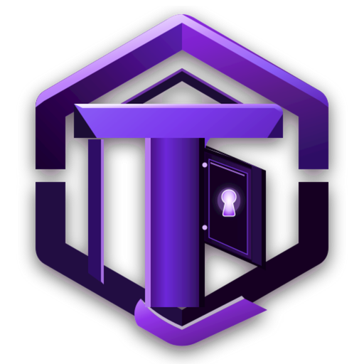

<p align="center">
  
</p>

<h1 align="center">TotumVault</h1>

<p align="center">
  <strong>Your personal vault for passwords, credentials, codes, cards, private notes, and encrypted documents.</strong><br>
  Local-first. Encrypted. Designed to stay under your control.
</p>

<p align="center">
  <a href="https://github.com/RoyalRohan/TotumVault/releases">Releases</a> ·
  <a href="https://github.com/RoyalRohan/TotumVault/issues">Issues</a> ·
  <a href="https://github.com/RoyalRohan/TotumVault/blob/main/SECURITY.md">Security</a>
</p>

---

## What TotumVault is

TotumVault is a local-first password, credential, and document manager built around one simple idea: your vault should belong to you.

The application stores vault data locally, uses authenticated encryption for sensitive payloads and files, does not require a TotumVault account, and is designed to work completely offline without cloud dependencies. The project is built with Tauri 2, Rust, React, TypeScript, SQLite, and Tailwind CSS.

TotumVault supports purpose-built records for logins, secure notes, authenticators, payment cards, software licenses, servers, API credentials, and encrypted documents/bills. Each type has its own editor and presentation rather than forcing unrelated data into one generic form.

## Highlights

- **Local-first vault** — credentials and documents stay on the device unless you explicitly export an encrypted backup.
- **Encrypted storage** — sensitive entry payloads and document pages are protected with AES-256-GCM authenticated encryption using unique random nonces.
- **Privacy Screen Shield & Capture Defense** — hardware window display affinity (`WDA_EXCLUDEFROMCAPTURE` on Windows, native compositor isolation on Wayland, `FLAG_SECURE` on Android) paired with an active application privacy shield that obscures the window with deep frosted glass (`blur(36px)`) when unfocused, minimized, or upon screenshot shortcut detection (`PrintScreen`, `Win+Shift+S`, `Ctrl+Shift+S`).
- **Multi-Tier Smart Clipboard Protection** — background OS clipboard purges (`wl-copy` on Wayland, `xclip`/`xsel` on X11, `clip` on Windows, `pbcopy` on macOS) with non-collapsed range replacement, return-to-window sticky flush, and custom countdowns (`5s`, `15s`, `30s`, `60s`, `Never`) or manual instant purge.
- **Secure Notes Hide / Reveal** — instant Eye/Eye-Off toggle to mask sensitive private note contents with automatic visibility reset upon closing or vault lock.
- **Software License Expiry Engine** — local calendar date boundary evaluation (active through 23:59:59.999 local time) and ISO timezone preservation with categorized sections (*Active*, *Expires Soon*, *Expired*, and *Lifetime / No Expiry*).
- **Hierarchical Login Subfolders** — create, rename, and delete nested folders with safe cascade deletion and unified instant search across all subfolders.
- **Hardware Biometric Unlock** — unlock on supported platforms with Class 3 Strong Biometrics (`BIOMETRIC_STRONG`) with hardware Keystore binding and a 3-attempt lockout policy.
- **Secure Document & Bill Vault** — safely scan and store bills, receipts, IDs, certificates, warranties, and insurance cards.
- **On-Device Scanner & Perspective Crop** — live camera capture with viewfinder, image uploads, automatic local contrast edge detection, 4-corner perspective adjustment, 90° rotation, and document text clarity enhancement.
- **Multi-Page Carousel Viewer** — high-resolution pan and zoom, bottom thumbnail strip, page reordering, page deletion, and metadata management.
- **Horizontal Mouse Scroll & Pan** — mouse wheel horizontal scrolling, click-and-drag pan, and navigation buttons for category chips and document carousels.
- **Curated Typography Selection** — choose between 5 developer-grade fonts (**Inter**, **Geist Sans**, **IBM Plex Sans**, **JetBrains Mono**, **Fira Code**) with clean interface rendering.
- **Safe Import with Conflict Resolution** — pre-inspect backup files (`.tvault`, legacy `.vlock`) and spreadsheets (`.csv`) before writing to disk; choose between non-destructive merge ("Add to Existing Vault") and explicit confirmation for overwrite ("Replace Existing Vault"), with duplicate resolution strategies (Keep Existing, Import Both, Replace Existing).
- **Dual-Layer Transaction Safety** — SQLite transaction safety combined with automatic physical snapshot backup and rollback to prevent corruption during imports.
- **Password-based key protection** — Argon2id derives the key that unwraps the Vault Encryption Key (VEK).
- **Built-in authenticator** — offline RFC 6238 TOTP generation with configurable intervals and hash algorithms.
- **Password generator** — cryptographically secure password and passphrase generation using OS CSPRNG.
- **Security health audit** — identify weak, reused, or missing-2FA credentials with Shannon-entropy scoring.
- **Encrypted `.tvault` backups** — portable vault archives containing all credentials and document pages (with backward compatibility for legacy `.vlock` archives).
- **Auto Update Checker** — integrated GitHub releases update checker with direct download notes.
- **Dark, Light, and System themes** — modern dark-purple glass-panel interface with full system theme synchronization.
- **Cross-platform releases** — native builds for Windows, macOS, Ubuntu/Debian, Fedora/RPM, Arch Linux, and Android.

## Vault item types

| Type | Intended for | Examples |
|---|---|---|
| **Logins & Folders** | Website and app accounts organized in nested folders | Username, password, URL, optional TOTP, folder hierarchy |
| **Documents & Bills** | Bills, IDs, receipts, contracts, records | Multi-page scans, bills, IDs, warranties, receipts, favorites |
| **Secure Notes** | Private text and recovery information with eye-toggle masking | Recovery codes, confidential notes, seed phrases |
| **Authenticators** | Standalone 2FA secrets | TOTP secret, issuer, account |
| **Payment Cards** | Card credentials | Card number, expiry, CVV, billing address, PIN |
| **Software Licenses** | Product licenses with dynamic expiry tracking | License key, vendor, version, dates, lifetime/active badges |
| **Servers & SSH** | Infrastructure credentials | Host, port, protocol, username, SSH key |
| **API Credentials** | Developer/service secrets | Endpoint, API key, token, client credentials |

## Download an official release

Official builds are published on GitHub:

**[Download TotumVault Releases →](https://github.com/RoyalRohan/TotumVault/releases)**

Open the newest release and download the artifact for your platform. Use the package that matches your operating system and CPU architecture.

### Windows

Download the Windows installer (`.exe`) from the release assets and run the installer.

### Fedora / RHEL-based Linux

Download the **x86_64 `.rpm`** package from the release assets, then install it with:

```bash
cd ~/Downloads
sudo dnf install ./totumvault-<version>-1.x86_64.rpm
```

For example:

```bash
sudo dnf install ./totumvault-1.3.1-1.x86_64.rpm
```

### Ubuntu / Debian-based Linux

Download the **`.deb`** package and install it with:

```bash
cd ~/Downloads
sudo apt install ./totumvault-<version>-amd64.deb
```

For example:

```bash
sudo apt install ./totumvault-1.3.1-amd64.deb
```

### Arch Linux

Download the **`.pkg.tar.zst`** package from the release assets and install it with:

```bash
cd ~/Downloads
sudo pacman -U ./totumvault-<version>-1-x86_64.pkg.tar.zst
```

### Linux AppImage

Download the **`.AppImage`**, make it executable, and run it:

```bash
chmod +x TotumVault*.AppImage
./TotumVault*.AppImage
```

### Android

Download the Android **`.apk`** from the release assets (`aarch64`, `armv7`, or `universal`) and install it on your device. Android may require permission to install applications from the browser or file manager you used to download the APK.

### macOS

Download the **`.dmg`** package (Universal binary supporting both Apple Silicon and Intel Macs), open the disk image, and drag TotumVault into your Applications folder.

## Backups & Safe Import

TotumVault backups use the `.tvault` format (with full backward-compatible import support for legacy `.vlock` files) and contain encrypted vault data, including credentials and document pages. Keep backups somewhere you control, such as an external drive or a trusted storage provider.

When restoring or importing data:
- **Pre-Inspection**: Preview the total items, documents, and duplicate conflicts before committing changes.
- **Duplicate Handling**: Choose between **Keep Existing** (skips duplicates), **Import Both** (imports duplicates as new copies), or **Replace Existing** (updates existing entries).
- **Import Mode**:
  - **Add to Existing Vault**: Merges imported credentials and documents into your current vault without deleting existing items.
  - **Replace Existing Vault**: Requires explicit confirmation (*"This will permanently remove the existing vault entries after import. Continue?"*) before performing a clean restore.
- **Fail-Safe Rollback**: A local snapshot is created before import execution and automatically restored if any database error occurs.

## Build from source

### Prerequisites

- Node.js 20+
- npm
- Rust and Cargo 1.75+
- Tauri prerequisites for your operating system

### Clone

```bash
git clone https://github.com/RoyalRohan/TotumVault.git
cd TotumVault
```

### Install dependencies

```bash
npm install
```

### Run the frontend

```bash
npm run dev
```

### Run the native desktop application

```bash
npm run tauri dev
```

### Verify the project

```bash
npm run build
cd src-tauri && cargo test
cargo clippy -- -D warnings
```

### Build production bundles

```bash
npm run tauri build
```

## Architecture and security

TotumVault uses a Tauri 2 frontend/backend boundary with Rust handling vault operations, cryptography, SQLite persistence, clipboard protection, TOTP generation, document encryption, and backup import/export.

The cryptographic design uses Argon2id to derive a Key Encryption Key (KEK) that unwraps the Vault Encryption Key (VEK). Vault items and document pages are encrypted using AES-256-GCM with unique 96-bit nonces. Active key material and decrypted image buffers are zeroized from memory when the vault locks.

Read the project security documents for detailed technical specifications:

- [ARCHITECTURE.md](./ARCHITECTURE.md)
- [SECURITY.md](./SECURITY.md)
- [THREAT_MODEL.md](./THREAT_MODEL.md)
- [PRIVACY.md](./PRIVACY.md)

## Privacy

TotumVault does not require an account, subscription, or registration. The project is designed strictly for local offline storage and does not send data to any remote server.

See [PRIVACY.md](./PRIVACY.md) for the project's current privacy commitments and boundaries.

## Contributing

Contributions are welcome when they improve reliability, usability, accessibility, or security. Please read [CONTRIBUTING.md](./CONTRIBUTING.md) before opening a pull request.

Security-sensitive changes should receive careful review and must not introduce plaintext secret handling or unnecessary network dependencies.

## Reporting a security issue

Please do not publish an unverified security vulnerability in a public GitHub issue. Follow the private reporting process in [SECURITY.md](./SECURITY.md).

## Project status

TotumVault is an actively developed personal/open project. Treat releases as the authoritative source for downloadable application builds, and read the release notes for platform-specific changes.

## License and source availability

TotumVault is **source-available software**, not an OSI-certified open-source project. The source is published so it can be inspected, studied, and contributed to, while distribution of modified or unofficial builds is reserved to the project owner unless separately authorized.
